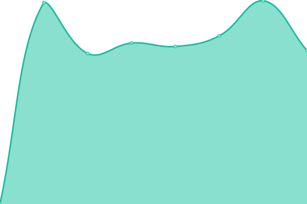
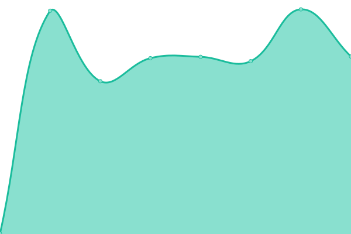
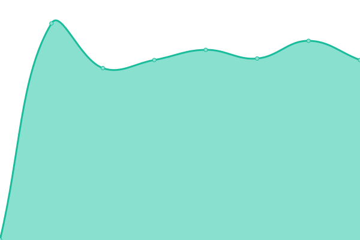

# [📈 Live Status](https://enzoglt.github.io/qualimenti-uptime): <!--live status--> **🟧 Partial outage**

This repository contains the open-source uptime monitor and status page for [enzoglt](https://enzoglt.github.io/qualimenti-uptime), powered by [Upptime](https://github.com/upptime/upptime).

With [Upptime](https://upptime.js.org), you can get your own unlimited and free uptime monitor and status page, powered entirely by a GitHub repository. We use [Issues](https://github.com/enzoglt/qualimenti-uptime/issues) as incident reports, [Actions](https://github.com/enzoglt/qualimenti-uptime/actions) as uptime monitors, and [Pages](https://enzoglt.github.io/qualimenti-uptime) for the status page.

<!--start: status pages-->
<!-- This summary is generated by Upptime (https://github.com/upptime/upptime) -->
<!-- Do not edit this manually, your changes will be overwritten -->
<!-- prettier-ignore -->
| URL | Status | History | Response Time | Uptime |
| --- | ------ | ------- | ------------- | ------ |
|  [Shop Qualimenti](https://shop.qualimenti.com) | 🟩 Up | [shop-qualimenti.yml](https://github.com/enzoglt/qualimenti-uptime/commits/HEAD/history/shop-qualimenti.yml) | 

 832ms
     
 | 

<a href="https://enzoglt.github.io/qualimenti-uptime/history/shop-qualimenti">100.00%</a>
    

|  [App Qualimenti](https://app.qualimenti.com) | 🟩 Up | [app-qualimenti.yml](https://github.com/enzoglt/qualimenti-uptime/commits/HEAD/history/app-qualimenti.yml) | 

 606ms
     
 | 

<a href="https://enzoglt.github.io/qualimenti-uptime/history/app-qualimenti">100.00%</a>
    

|  [Q-Events](https://q-events.it) | 🟩 Up | [q-events.yml](https://github.com/enzoglt/qualimenti-uptime/commits/HEAD/history/q-events.yml) | 

 660ms
     
 | 

<a href="https://enzoglt.github.io/qualimenti-uptime/history/q-events">100.00%</a>
    

|  Nginx Proxy | 🟥 Down | [nginx-proxy.yml](https://github.com/enzoglt/qualimenti-uptime/commits/HEAD/history/nginx-proxy.yml) | 

 111ms
     
 | 

<a href="https://enzoglt.github.io/qualimenti-uptime/history/nginx-proxy">62.43%</a>
    

<!--end: status pages-->

[**Visit our status website →**](https://enzoglt.github.io/qualimenti-uptime)

## 📄 License

- Powered by: [Upptime](https://github.com/upptime/upptime)
- Code: [MIT](./LICENSE) © [enzoglt](https://enzoglt.github.io/qualimenti-uptime)
- Data in the `./history` directory: [Open Database License](https://opendatacommons.org/licenses/odbl/1-0/)
